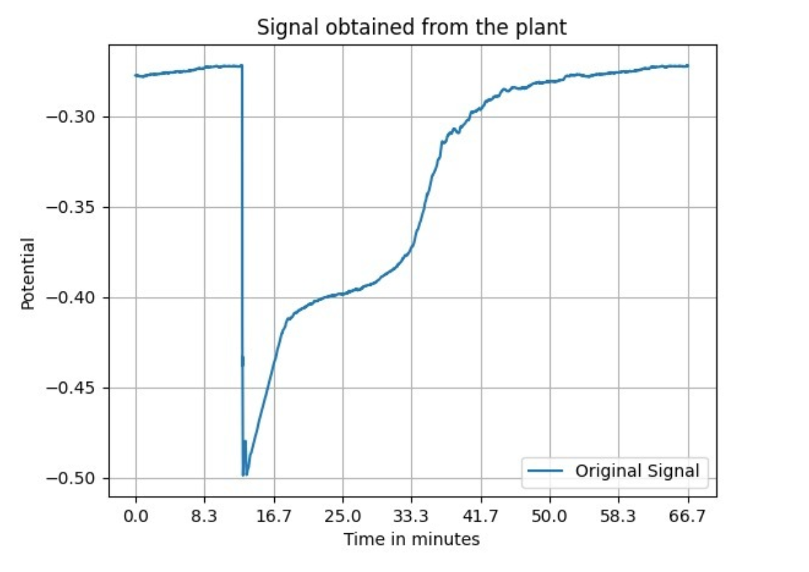
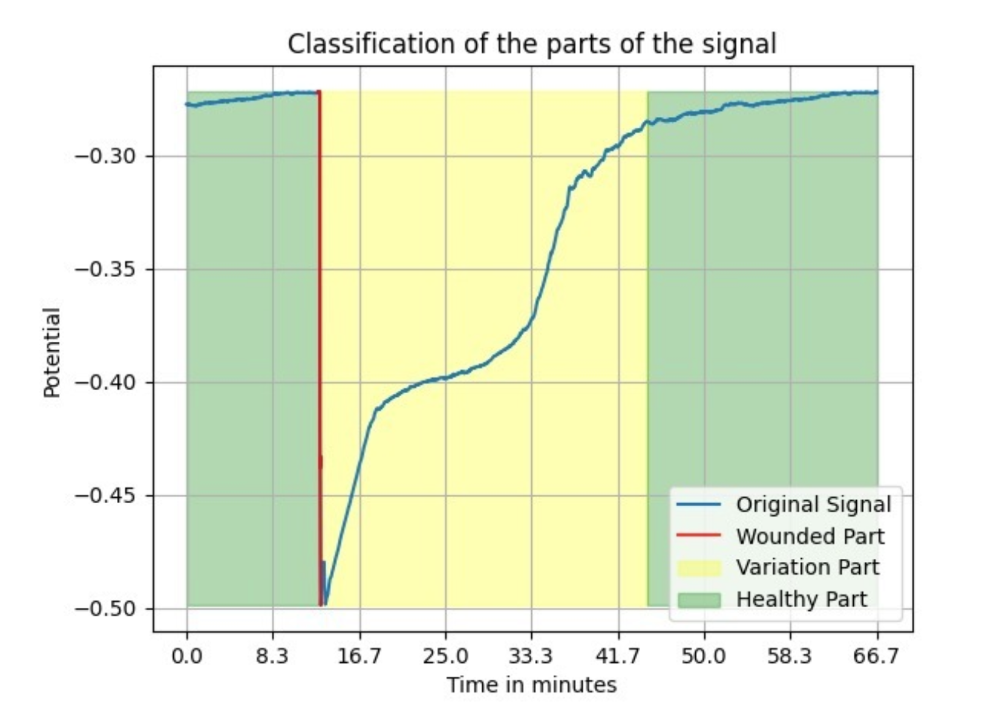
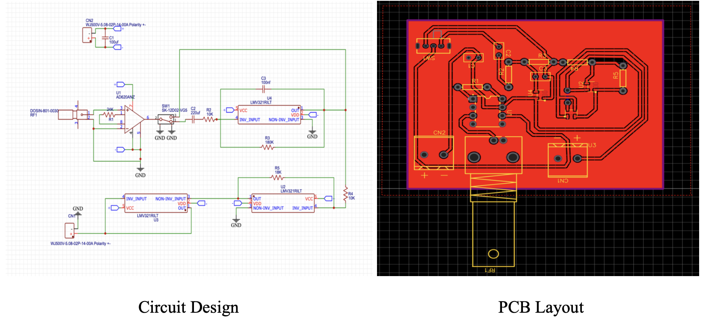

# Signal and Classification

  
  

# Machine Learning For Electrophysiological Signal Study: Measuring, Analyzing, and Classifying Plant Responses

This project takes an interdisciplinary approach, integrating experimental biology, electrical engineering, and computational methods to study and interpret plant electrophysiology. The endeavor involved the cultivation of tobacco plants, the development of an electrophysiological measurement device, data collection using a DAQ system, and signal processing and analysis. The primary focus is on the machine learning aspects for classifying plant responses to wounding.

## Table of Contents

- [Experimental Plant Distribution and Growing Conditions](#experimental-plant-distribution-and-growing-conditions)
- [Signal Measurement Methodology](#signal-measurement-methodology)
- [Attempt at Signal Processing Circuit Design](#attempt-at-signal-processing-circuit-design)
- [Data Acquisition Methodology](#data-acquisition-methodology)
- [Data Collection and Pre-processing](#data-collection-and-pre-processing)
- [Exploratory Data Analysis](#exploratory-data-analysis)
- [The Algorithm](#the-algorithm)
  - [Model 1: Detection of the First Phase (Wounding Time)](#model-1-detection-of-the-first-phase-wounding-time)
  - [Model 2: Detection of Recovery Phase](#model-2-detection-of-recovery-phase)
  - [Algorithm Workflow: Detection of Injury Onset and Variation Potential Duration](#algorithm-workflow-detection-of-injury-onset-and-variation-potential-duration)
  - [End-to-End Testing on Unseen Data](#end-to-end-testing-on-unseen-data)
- [Acknowledgements](#acknowledgements)

## Experimental Plant Distribution and Growing Conditions

Nicotiana tabacum plants were cultivated in a controlled laboratory environment to ensure consistent and diverse data collection. The experiment involved 32 plants, segregated into two batches of 16 plants each, with a two-month interval between their initiation to encompass a varied age range within the dataset.

## Signal Measurement Methodology

To measure plant signals using an invasive methodology, Ag/AgCl electrodes were prepared, and an experimental setup was designed. One electrode was inserted near the leaf's base, and the other was grounded. When the leaf was wounded, electrical recordings were captured using the Ag/AgCl electrodes.

## Attempt at Signal Processing Circuit Design

A circuit was designed and prototyped for filtering and amplifying received signals from the probes. The designed circuit aimed for a total amplification of 72 times and signal filtering within the 0.01 Hz to 10 Hz range. However, upon actualization, the circuit encountered significant noise issues, rendering it non-functional.

### Circuit Diagram

## Data Acquisition Methodology

The electrodes were soldered to wires and directly interfaced as analogue inputs to the NI DAQ 6009 device. The NIDAQMX library in Python was utilized for signal handling and interpretation. The data acquisition process operated at a sampling rate of 100 samples per second.

## Data Collection and Pre-processing

- **Variation Potential Signal Description**: The variation potential signal exhibits a weak amplitude, reaching a peak of a few tens of millivolts. Upon plant injury, the leaf's surface potential experiences a sudden drop over a few seconds, gradually returning to a constant normal value within 15 to 45 minutes.

- **Data Description**: Over 50 hours of plant electrical signal data were collected, including 36 variation potential measurements, an equal number of baseline data representing a healthy plant state, and additional noisy data.

- **Digital Data Filtering**: A combination of Butterworth filtering, median filtering, and Savitzky-Golay filtering was applied to enhance signal quality and reduce noise.

## Exploratory Data Analysis

- **Visualization**: Variation potential signals were visualized alongside normal baseline and noisy signals to discern patterns and differences.

- **Statistical Analysis**: Statistical measures were applied to quantify differences between variation potential and other signal types for subsequent classification modeling.

- **Data Cleaning Confirmation**: Data consistency was checked post-pre-processing to maintain reliability for accurate classification modeling.

## The Algorithm

The algorithm is designed to analyze plant signal data and detect distinct phases corresponding to plant injury events. It comprises two distinct models, each addressing a specific phase in the plant signal.

### Model 1: Detection of the First Phase (Wounding Time)

- **Data Preparation**: Segments of 500 samples (~8 seconds) containing wounding segments and healthy plant signal segments.
- **Feature Extraction**: Max-min difference, last value minus initial value, variance, and interquartile range (IQR) were extracted from each segment.
- **Model Training**: A Support Vector Machine (SVM) model with the RBF kernel was trained to distinguish sudden drop segments from non-sudden drop segments.

### Model 2: Detection of Recovery Phase

- **Data Preparation**: Segments of 5000 elements (~80 seconds) comprising recovery segments and non-recovery segments.
- **Feature Extraction**: Time gap from wounding time, statistical measures (max, min, max-min difference, last value, initial value, last value-initial value, variance, and IQR) were extracted from each segment.
- **Model Training**: An SVM model with the RBF kernel was trained to identify recovery phase segments.

### Algorithm Workflow: Detection of Injury Onset and Variation Potential Duration

The algorithm leverages both models to achieve the following objectives:

1. **Detection and Confirmation of Wounding Time**:
   - Model 1 analyzes 500-sample segments to detect wounded signal segments.
   - Conditions are applied to confirm the wounding time and validate the subsequent recovery phase segments using Model 2.

2. **Detection of Recovery Phase Duration**:
   - Model 2 analyzes 5000-length segments to discern recovery phase segments.
   - The algorithm determines the duration of the recovery phase by sequentially evaluating segments starting from the identified wounding time.

### End-to-End Testing on Unseen Data

- **Overall Algorithm Performance**: The algorithm displayed strong performance on unseen signal data, accurately determining both the onset of injury and the recovery time range.
- **Task 1 Success Rate**: Achieved a perfect success rate of 100% in accurately identifying the onset of injury.
- **Task 2 Success Rate**: Predicted the variation potential duration with good precision, effectively delineating the recovery phase.

## Acknowledgements

We extend our gratitude to:

- Prof. Subramanian Sankaranarayanan for his supervision and continuous support throughout the project.
- Prof. Archana Kumari, GBU, for her guidance in plant electrophysiology.
- Prof. Rajendran, for his expertise in circuit design.
- PhD Scholar Hemal Bhalla and Postdoc Charlie Kaushal for their support in plant cultivation.
- The staff of the Electrical Engineering and Biological Sciences and Engineering labs.

